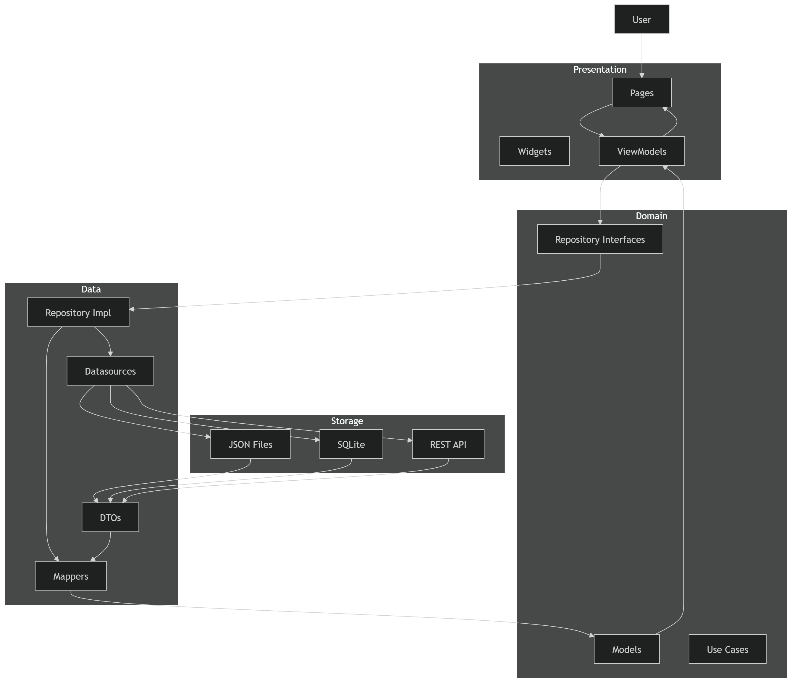

# Making a Bloodpressure App with AI Step by Step
A Flutter Only Basic Blood Pressure App made step-by-step with help of AI. It will be for android for now, later will add packages and other environments.

## 0. Necessary packages
Add the package to the pubspec.yaml dependencies. Run `flutter pub get`.
### Path Provider
- path_provider is a Flutter package that tells your app where to store files by giving you platform-appropriate filesystem paths (like the app’s documents directory, temporary directory, etc.).
- >path_provider: ^2.1.4
## 1. Folder Structure
**These folder structures are recommend by AI:**
### Feature-First Approach (Small-to-Large apps)
```
lib/
  main.dart
  app.dart
  // Entry point + root app widget.
  // Why: this is where the app starts and where global setup lives (routing, theme setup, global state wiring).

  core/
    di/
      // Dependency wiring.
      // Why: create objects and connect interfaces to their implementations in one place.
      // This keeps feature code from knowing how everything is constructed.

    errors/
      // Shared error types.
      // Why: ViewModels and UI can handle errors in a consistent way.

    theme/
      // Theme constants.
      // Why: keep colors/styles/numbers in one place instead of copying them into widgets.

    utils/
      // Shared helpers.
      // Why: small generic functions used across multiple parts of the app.

  features/
    blood_pressure/
      // One feature “slice”.
      // Why: keeps code related to blood pressure in one location instead of mixing it with other features.

      domain/
        models/
          // Domain entities.
          // Why: these are the app’s core concepts (the data shape the app should use everywhere).
          // Domain entities should not depend on Flutter or storage details.

        repositories/
          // Repository interfaces (contracts).
          // Why: define what the app needs to do (read/add/etc) without saying where data comes from.

      data/
        datasources/
          local/
            // Local storage implementations.
            // Why: put storage-specific code here (files/database preferences, etc).
            // This layer knows how to store and load raw data.
            // It should not contain app UI code.

            bp_local.dart
              // Concrete local datasource for blood pressure readings.

        mappers/
          // Converts between different representations of the same data.
          // Why: storage formats often do not match domain formats.
          // Mappers translate storage data into domain entities and back.

          bp_mapper.dart
            // Transforms between local/store shapes and domain entities.

        repositories/
          // Concrete repository implementations.
          // Why: this layer connects domain contracts to data sources and mappers.
          // It calls the datasource, maps results into domain entities, and returns them.

          // (Add bp_repository_impl.dart or similarly named file here.)

      presentation/
        viewmodels/
          // ViewModel state + actions for this feature.
          // Why: UI should be mostly rendering; ViewModels hold UI state and respond to user actions.
          // ViewModels call the domain repository interfaces.

          bp_list_vm.dart
            // State and actions for the readings list screen.

          bp_form_vm.dart
            // State and actions for the add/edit form screen.

        pages/
          // Flutter screens and routes for this feature.
          // Why: only here should widgets and navigation logic live for this feature.

          bp_list_page.dart
            // Builds the list UI and uses bp_list_vm.dart state.

          bp_add_page.dart
            // Builds the form UI and uses bp_form_vm.dart state.

        widgets/
          // Reusable widgets that belong only to this feature.
          // Why: avoid putting feature-specific widgets in the app-wide widgets folder.

          bp_reading_card.dart
            // UI component that displays a single reading.

  widgets/
    // App-wide reusable widgets (optional).
    // Why: things reused across multiple features go here.

  services/
    // Non-UI, non-persistence services (optional).
    // Why: shared capabilities that aren’t tied to one feature (like a clock/time provider).
    // Keeping these here reduces duplicated code across features.

```

### Type-First Approach (Small-To-Medium Apps)
```
lib/
  main.dart

  core/
    di/                      // where you wire dependencies (repo/datasources/viewmodels)
    theme/                   // app theme (optional)
    utils/                   // shared small helpers (optional)

  data/
    datasources/local/       // local storage implementations (web + windows)
    mappers/                 // dto <-> domain converters
    models/                  // DTOs (JSON/storage shapes)

  domain/
    models/                  // domain entities (what the app uses)
    repositories/            // repository interfaces (contracts)

  presentation/
    pages/                   // screens (List/Add)
    viewmodels/             // ChangeNotifier state/actions
    widgets/                 // reusable UI widgets

  services/
    clock_service.dart       // optional: time provider (optional)
```

***
***
***
## 2. Create domain model and repository interface
This step is for creating the core “meaning” of a blood pressure reading (domain model) and the rules for how the app reads/writes readings (repository interface) so your UI/ViewModel can work with a consistent API while the storage implementation can change later without affecting the UI/ViewModel.

### Domain Model
**A “domain” is the real-world problem your app is about.**
Is a plain Dart class that represents what your app means by a “blood pressure reading”.
Exists, so the rest of the app (UI/ViewModel) can work with one consistent shape that represents your business concept, not how/where you store it. The UI should not care about JSON, localStorage, file paths, etc.

> 🤓 Comes from the problem you’re solving (blood pressure tracking). You look at the app requirements and decide what “a reading” must contain.

> 💡 So domain model = Dart class that represents that real-world concept in a clean app-friendly way (not JSON/file details).

### Repository Interface
**A “repository” is a layer that stores and retrieves data.**
Is abstract definition of the operations your app needs, like:
- “get all readings”
- “add a reading”
- “delete a reading”
ViewModels depend on this interface, not on storage details.
That’s the whole point: ViewModels call the repository interface; the repository implementation decides where data comes from (web localStorage, desktop file, etc).

Real-life example: Think of a payment app. The UI might call PaymentRepository.pay(amount). It doesn’t care whether the payment goes through Stripe, Adyen, or a mock for testing.

> 🤓 So the ViewModel can be written once, and later you can change the storage (localStorage, file, database) without changing the ViewModel—as long as the repository still follows the same contract.

> 💡 So repository interface = the “contract” for operations like get all readings, add, delete—without saying where it’s stored (web localStorage, a file, etc.).

***
***

## 3. Create the storage DTO and mapper
Create a storage DTO that matches readings are stored/transferred (e.g., JSON/file fields). Then create a mapper to convert between this DTO and your domain model so the domain stays independent from storage details.

### DTO (Data Transfer Object)
**A class that matches the exact shape you store in JSON / localStorage.**
Storage formats usually don’t match your domain model perfectly. You create storage DTOs so that storage format changes don’t ripple into your UI/ViewModel—only the repository’s mapping changes.

A Storage might:
- use different field names
- store numbers as strings
- have fields you don’t want in the domain

> 🤓 Real-life example: You might store a birthday in JSON as "birthday":"1990-01-05". Your domain might want DateTime birthday instead. So you store as a DTO-friendly format, then convert.

> 💡 A DTO helps the domain model because the repository converts between the DTO (storage format) and the domain model (app meaning), so your domain model doesn’t depend on JSON/file/localStorage details.

### Mapper
**A Mapper is Code that converts between DTO ⇄ Domain model**

> 🤓 Real-life example: Imagine your UI shows “mmHg”. Your JSON storage might store raw numbers only. Mapper can attach the meaning (or at least ensure the domain model is correct).

> 💡 Without a mapper, you’d end up with conversion logic inside ViewModels or UI like parse JSON, rename fields or convert types

***
***

## 4. Implement local data source and RepositoryImpl

### Local Data Source
**the lowest level “storage worker” that knows how to read/write somewhere (e.g. localStorage or JSON-File)**

> 🤓 Real-life example: If you store app settings, you might store them in:
>- a config file on desktop
>- localStorage on web The code to read/write those is different, so you keep it in a dedicated layer.

> 💡 All storages work differently. The file system API and localStorage API are for example not the same. So you isolate that complexity.

### Repository Implementation
**Is the concrete class that implements your [repository interface.](#2-create-domain-model-and-repository-interface)** Delegates to the local data source and uses mappers to convert between domain models and storage DTOs for each operation.

> 🤓 Real-life example: repository impl reads from browser localStorage. maps stored JSON data into BpReading for Web. Differently on Desktop.

> 💡  it connects everything:
>1. ViewModel calls repository interface (domain contract)
>2. Repository implementation calls local data source (storage access)
>3. Repository implementation uses mapper:
> - DTO → domain model when reading
> - domain model → DTO when saving
>4. Repository implementation returns domain objects to the app

***
***

## 5. ViewModel
**A ViewModel is a class that sits between your UI (Widgets/Pages) and your app logic (repositories).** A ViewModel holds:
- Holds screen state (e.g., “current list of readings”, “is loading”, “error message”)
- Exposes that state to the UI
- Has actions the UI triggers (e.g., “load readings”, “save new reading”)
- Calls repositories to do real work (read/write data)
- Notifies the UI when state changes (commonly via ChangeNotifier, ValueNotifier, Riverpod/Bloc equivalents, etc.)

It depends on the Repository Interface — so it doesn’t know anything about JSON/files.


> 💡 So the UI becomes mostly “dumb”: it renders whatever the ViewModel says, and tells the ViewModel when the user taps something.

Views are self explanatory as they only contain UI.

***
***
## 6. Dependency Injection Wiring (DI)
**It means you provide an object (like your repository) to the things that need it (like your ViewModels) instead of those classes creating it themselves.** So wiring is construction + connection, kept in one place so feature code stays clean and testable. It’s a common software engineering pattern (not a Flutter-specific feature).

ViewModel BpListVm needs a BpRepository. **wiring** gives it a BpRepositoryImpl. BpRepositoryImpl is built with BpLocalDataSource and BpMapper

In Flutter/Dart you typically do it manually by calling constructors in main.dart

Todo for some other time:
core/di/ to wire repository + viewmodels (or do it directly in main.dart first).
***
***




